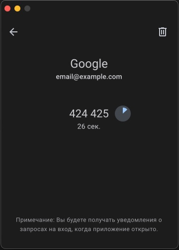

# Multifactor Desktop

Это приложение - порт приложения multifactor.ru с Android на десктоп,
позволяет вам использовать возможности этого сервиса на ноутбуках и компьютерах.

Реализованные функции:
- Добавление/удаление аккаунтов
- Генерация одноразовых кодов
- Подтверждение входа
- Уведомления о входе

На MacOS есть возможность установить подверждение по TouchID, на остальных устройствах подтверждение происходит пин-кодом

## 1. Установить проект:

с помощью NPM:
```
npm i
```

с помощью Yarn:
```
yarn install
```

## 2. Установить приложение:

Поддерживаемые ОС: Windows, MacOS, Linux

Для Windows:
```
yarn build:win
```
Для MacOS:
```
yarn build:mac
```
Для Linux:
```
yarn build:linux
```

Обратите внимание, что после этой команды, вам необходимо установить приложение самостоятельно, используя установщик из папки dist.
Когда вы откроете приложение, вам будет предложено установить пин-код.

## Скриншоты:

<p>
  
  
  
  
  
  
</p>

## FAQ:

Q: Не теряется ли смысл двухфакторной авторизации с этим приложением? Я ведь вхожу на том же устройстве.

A: Нет, так как подтверждение входа в приложении имеет обязательное подтверждение входа пин-кодом или с TouchID.
